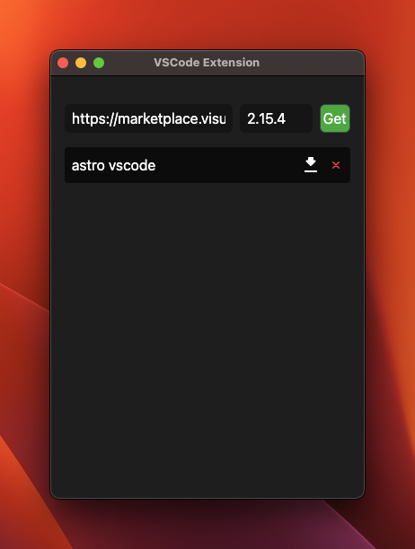
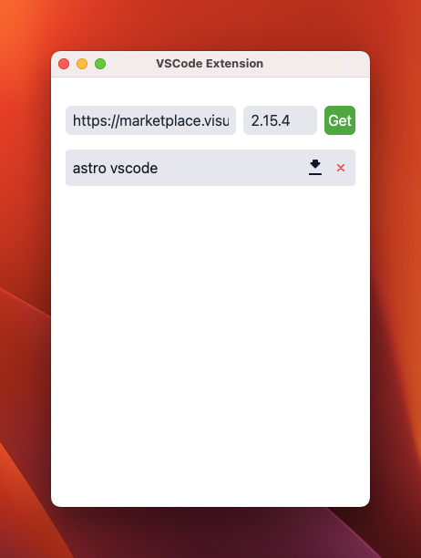

# VScode-Extension-Downloader-app
his app helps you easily download extensions from the Visual Studio Code Marketplace as .vsix files — without needing to open VS Code itself. It's perfect for alternative editors based on VS Code that don’t have full access to the Marketplace or for users who prefer manual control over their extensions.

## Download
[Download](https://github.com/dai-rewahandi/VScode-Extension-Downloader-app/releases)

## License
[MIT](https://github.com/dai-rewahandi/VScode-Extension-Downloader-app/blob/main/LICENSE)

## Demo

